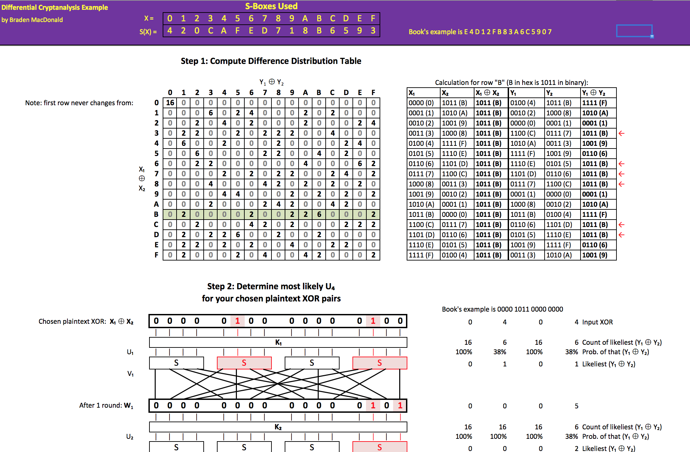
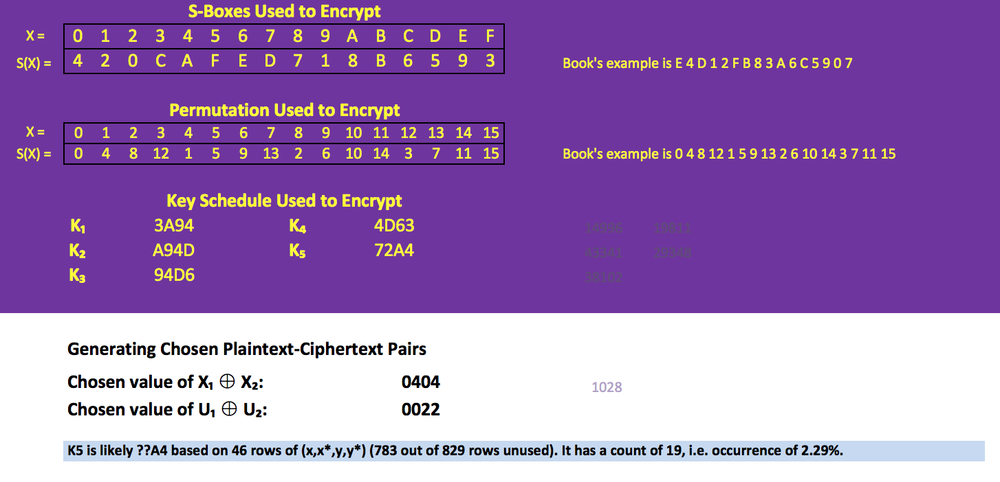

Differential Cryptanalysis Example
==================================

This Excel Spreadsheet contains a working example of a simple [Differential
Cryptanalysis](http://en.wikipedia.org/wiki/Differential_cryptanalysis)
attack against a substitution-permutation network (SPN) with 16-bit blocks and
4-bit S-boxes.

Implemented as a Visual Basic macro for use in Excel 2007 or newer.

The Excel workbook contains two sheets. The first, "How it works", is designed
for use in a lecture, in order to illustrate how Differential Cryptanalysis
works. The S-box can be edited, and the illustrated algorithm steps will
reflect the new S-box.

The second tab is a demonstration of an attack. You can edit the S-box,
permutation, and key schedule. The macros will then perform the attack
and show the most-likely value of part of key K5.

The textbook referenced in the spreadsheet is **Cryptography Theory and
Practice** 3rd ed. by Douglas Stinson.

Screenshots
-----------

Interactive Illustration of the Algorithm:

Demonstration of an attack:

License
-------

Copyright (c) 2011 Braden MacDonald

This software is provided 'as-is', without any express or implied
warranty. In no event will the authors be held liable for any damages
arising from the use of this software.

Permission is granted to anyone to use this software for any purpose,
including commercial applications, and to alter it and redistribute it
freely, subject to the following restrictions:

   1. The origin of this software must not be misrepresented; you must not
   claim that you wrote the original software. If you use this software
   in a product, an acknowledgment in the product documentation would be
   appreciated but is not required.

   2. Altered source versions must be plainly marked as such, and must not be
   misrepresented as being the original software.

   3. This notice may not be removed or altered from any source
   distribution.
